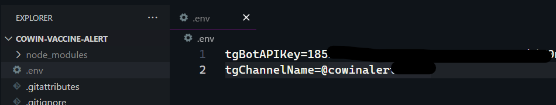

# cowin-vaccine-alert

Create vaccine slot alerts for yourself using NodeJS and a telegram Bot.

## Steps:

-   Create a telegram bot using `@BotFather` channel.
-   Enable the setting which allows bot to join channels using '/setjoingroups' on channel `@BotFather`.
-   Create a new channel and add the bot into that channel
-   Copy the bot's API Key and the channel name and put them into the .env file in root of this repo.
-   Customize the code to change districts, states, vaccine type or dose number.
-   Get vaccined 💉

Set up your env file like this
